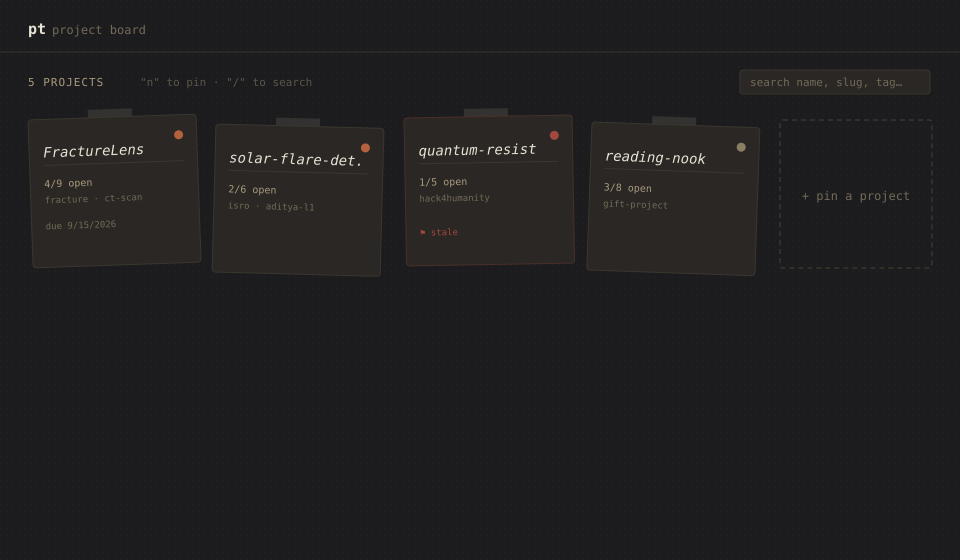
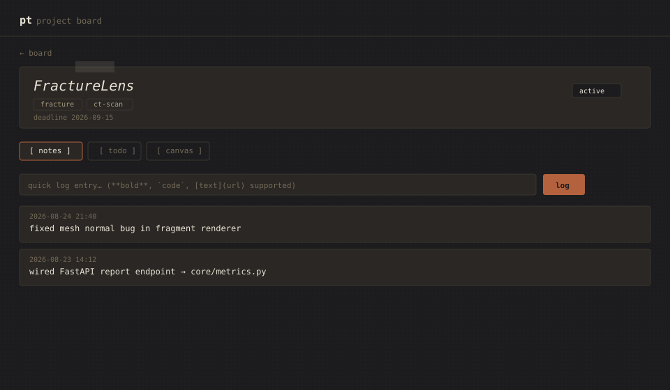
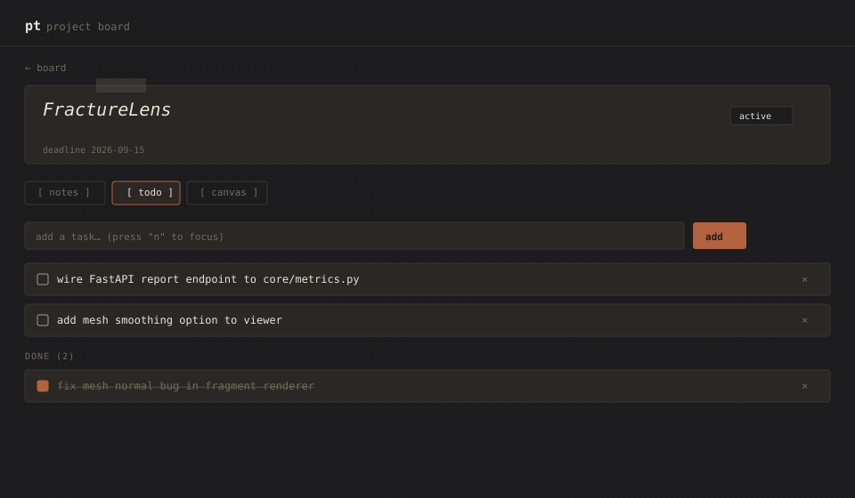
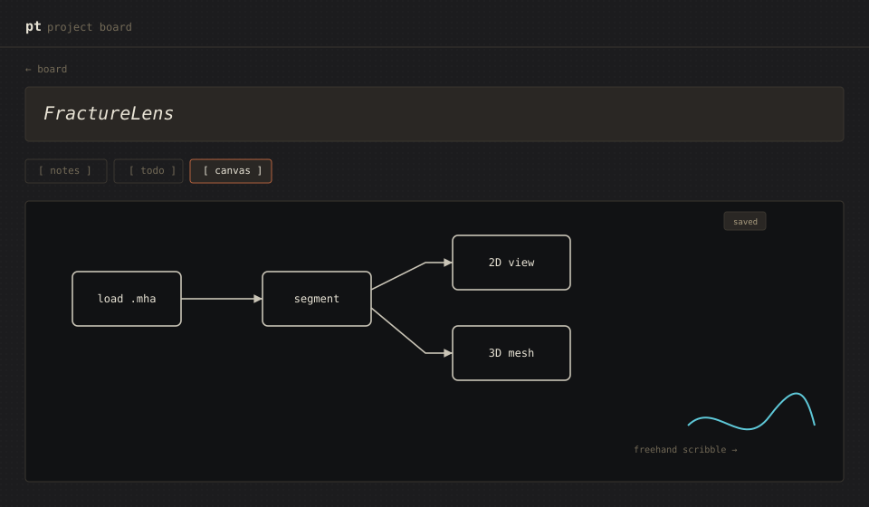

# pt — a local-first project tracker

A CLI + web tool for tracking multiple in-flight projects: notes, todos,
and freeform canvas (flowcharts/scribbles) per project, plus a
cross-project dashboard so nothing goes stale silently.

Built to replace an Obsidian + Excalidraw workflow with something that
gives a real "what's active, what's rotting" view across everything
you're juggling — hackathon builds, coursework, personal projects — at
once.



## Why

Most note tools are note-first. This is project-first: every project is
a folder of plain files (yaml/markdown/json), and the UI is just a
window into that folder. You can `cat` it, `grep` it, or edit it by
hand in Obsidian if you want — nothing is locked into a proprietary
format.

## Features

- **CLI capture** — log a note or add a todo in one command, no app to open
- **Cross-project dashboard** — pinboard view grouped by status
  (active / blocked / backlog / done), with a per-card open-todo count
  and a stale-project flag (no activity in 7+ days)
- **Per-project notes** — timestamped log, lightweight markdown
  (`**bold**`, `` `code` ``, `[links](url)`)
- **Per-project todos** — add, check off, delete
- **Per-project canvas** — freeform flowcharts/scribbles via
  [tldraw](https://tldraw.dev), autosaved
- **Tags + deadlines**, editable from the web UI
- **Search** (`/`) and quick-capture keyboard shortcuts (`n`)
- Data lives in flat files under `projects/` — git-friendly, diffable,
  no database





## Setup

Requires Python 3.10+ and Node 18+.

```bash
git clone <your-repo-url>
cd project-tracker

# backend
pip install -e .
pip install fastapi "uvicorn[standard]"

# frontend
cd web/frontend
npm install
cd ../..
```

Run both servers with one command:

```bash
./dev.sh
```

This starts the API on `:8000` and the web UI on `:5173`. Ctrl+C stops
both. (`dev.sh` just backgrounds `uvicorn` and `npm run dev` together
with a trap to kill both on exit — nothing fancier.)

Open `http://localhost:5173`.

## CLI usage

```bash
pt new <slug> --name "Display Name" --tags a,b,c   # scaffold a project
pt log <slug> "note text"                           # timestamped log entry
pt todo <slug> add "task text"
pt todo <slug> done <index>
pt todo <slug> list
pt status                                            # cross-project dashboard, in your terminal
pt status --stale                                    # only stale projects
pt open <slug>                                       # opens the project in the web UI
```

## Project structure

```
project-tracker/
├── pt/                    # CLI (Typer) + shared core logic
│   └── core/
│       ├── models.py      # Project, TodoItem, LogEntry, ProjectSummary
│       └── storage.py     # single source of truth for reading/writing
│                           #   project.yaml, notes.md, todo.md, canvas.json
├── web/
│   ├── backend/           # FastAPI, imports pt.core directly — CLI and
│   │                       #   web never diverge on how files are read/written
│   └── frontend/          # React + TypeScript + tldraw
├── projects/               # your actual data — one folder per project
└── dev.sh                  # runs backend + frontend together
```

Each project folder contains:

```
projects/<slug>/
├── project.yaml    # name, status, tags, deadline
├── notes.md        # append-only timestamped log
├── todo.md         # plain "- [ ] task" markdown, human-editable
└── canvas.json      # tldraw snapshot
```

## Notes

- `PT_PROJECTS_DIR` env var overrides where the CLI/backend look for
  `projects/`, if you'd rather store project data outside this repo
  (e.g. symlinked into each project's own git repo).
- The canvas is a full tldraw editor — pan/zoom, shapes, arrows,
  freehand drawing, text. It autosaves ~1s after you stop editing.

## Roadmap / ideas

Not yet built:
- Git integration (pull last-commit time/message per project automatically)
- Cross-project search over notes/todos
- Canvas ↔ note/todo linking (click a shape, attach a note)
- Auto-generated architecture diagrams from repo structure
- Export/backup as a zip
- Project templates (`pt new --template hackathon`)
- Due-soon surfacing on the dashboard, not just staleness
- Weekly digest (`pt status --since 7d`)
- Command palette (`Cmd+K`) in the web UI

## License

MIT (or your choice — not set yet)
